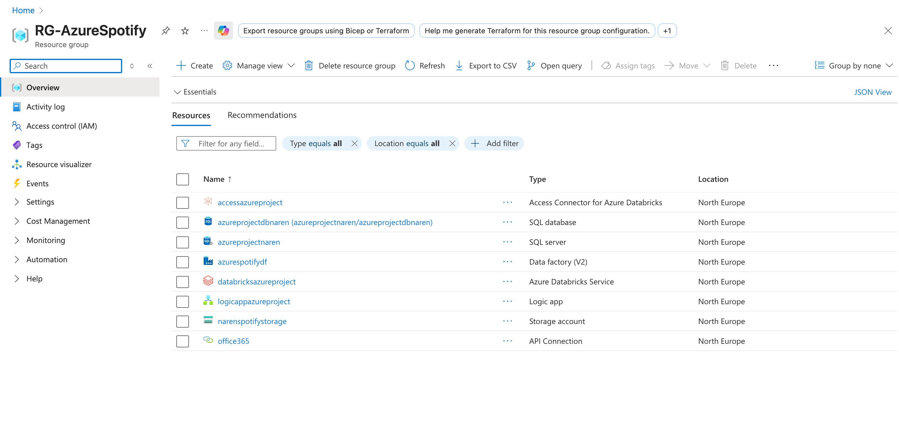
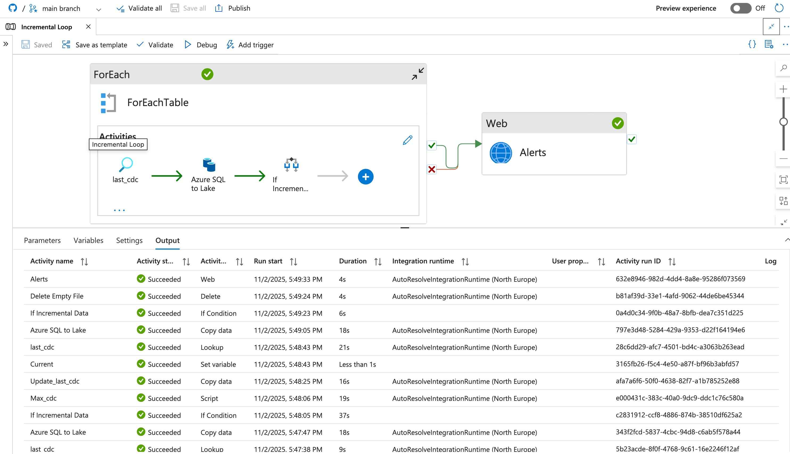

# Cloud-Scale Data Engineering project using Azure SQL, ADF CDC, Databricks Auto Loader, Delta Live Tables (SCD-2), and Unity Catalog — deployed to Dev & Prod with Databricks Asset Bundles.

End-to-end data engineering pipeline inspired by Spotify data flows, built on **Azure + Databricks** using the **Medallion Architecture**.

Key highlights:
- Incremental ingestion using **Azure Data Factory (CDC)**
- Raw zone stored in **ADLS Bronze**
- **Databricks Auto Loader** starts from Bronze → Silver (not at ingestion)
- **DLT + SCD-2** for Gold business tables
- **Databricks SQL Warehouse** + Power BI serving
- CI/CD using **Databricks Asset Bundles** + GitHub
- **Unity Catalog + Managed Identity** for governance & secure access

---

## 🏗️ Architecture Diagram


```text
project-root/
├─ Architecture/
│  └─ azure_medallion_architecture.png
├─ azure-data-factory/
│  ├─ pipelines/
│  │  └─ cdc_pipeline.json
│  ├─ datasets/
│  └─ linked-services/
├─ databricks/
│  ├─ asset-bundle/
│  └─ src/
│     ├─ silver/
│     ├─ gold/
│     │  └─ dlt/
│     └─ jinja/
├─ utils/
└─ README.md
```
## ☁️ Azure Resource Group & Provisioned Services

All cloud resources for this project are deployed inside a dedicated Azure Resource Group.

### Resource Group: `RG-AzureSpotify`

| Service | Purpose |
|---|---|
Azure SQL Database | Source transactional database  
Azure SQL Server | SQL hosting for source DB  
Azure Data Factory (V2) | CDC pipeline → Bronze  
Azure Databricks Workspace | Medallion ETL + DLT  
Azure Storage Account (ADLS Gen2) | Bronze / Silver / Gold zones  
Access Connector for Databricks | Secure access to ADLS  
Logic App | Alerts & automation  
Office365 Connection | ADF + Logic App notifications  

### Resource Group Screenshot



## Azure Data Factory — Incremental Pipeline (CDC)

### Pipeline Responsibilities
- Connect to **Azure SQL Source**
- Capture inserts/updates via **CDC**
- Land raw Parquet files into **ADLS Bronze container**
- Track watermark column for incremental loads

### Artifacts

```text
azure-data-factory/
├─ pipelines/
│  └─ cdc_pipeline.json
├─ datasets/
├─ linked-services/
```

### ADF Pipeline Screenshot
```

```

### ADF Run Output
```

```

---

## Bronze Layer — Raw Data Zone (ADLS Gen2)

### Purpose
Store raw immutable data exactly as received from source systems.

### Characteristics
| Property | Details |
|---|---|
Storage | ADLS Gen2 `/bronze/`
Format | Parquet (raw files)
Ingestion Tool | **Azure Data Factory (CDC)**
Transformation | None (schema-on-read)
Usage | Replay, lineage, auditing, time-travel

### Responsibilities
- Preserve **raw source fidelity**
- Maintain **auditability and traceability**
- Serve as input to **Databricks Auto Loader** in next stage (Silver)

### Folder Structure

```
adls/
└─ bronze/
   ├─ tableA/
   ├─ tableB/
   └─ metadata/
```

### Bronze Layer Screenshot
```

```

---

## Transition — Bronze → Silver

- Data moves from **Bronze to Silver**
- Triggered via **Databricks Auto Loader**
- Applied in next section

> Next section: `Silver Layer — Cleaned & Refined Data`

## Silver Layer — Cleaned & Refined Data (Databricks)

### Purpose
Transform raw Bronze data into clean, structured, and validated Delta tables.

### Characteristics
| Property | Details |
|---|---|
Storage | ADLS Gen2 `/silver/`
Format | Delta Lake
Engine | **Databricks Auto Loader + PySpark**
Schema | Cleaned, validated, conformed schema
Usage | Analytics-ready base tables for Gold layer

### Responsibilities
- Read raw data from **Bronze**
- Apply **schema enforcement**
- Handle **missing / bad records**
- Normalize and cast datatypes
- Deduplicate using watermark logic
- Write optimized **Delta tables**

### Processing Flow

```
Bronze (Raw Parquet/Delta)
     ↓ Auto Loader (streaming/batch)
PySpark cleansing + transformations
     ↓
Silver Delta Tables
```

### Folder Structure

```
adls/
└─ silver/
   ├─ cleaned_tableA/
   ├─ cleaned_tableB/
   └─ checkpoints/
```

### Notebook / Code Sample

```python
df = (spark.readStream.format("cloudFiles")
      .option("cloudFiles.format", "parquet")
      .load("/mnt/bronze/tableA"))

df_clean = (df
    .dropDuplicates(["id"])
    .filter("id IS NOT NULL")
    .withColumn("event_ts", col("event_ts").cast("timestamp"))
)

df_clean.writeStream \
    .format("delta") \
    .option("checkpointLocation", "/mnt/silver/checkpoints/tableA") \
    .start("/mnt/silver/cleaned_tableA")
```

### Auto Loader Config Screenshot
```

```

### Silver Tables Screenshot
```

```

---

## Transition — Silver → Gold

- Silver tables feed **Delta Live Tables (DLT)** pipelines
- Business rules & aggregations applied next

> Next section: `Gold Layer — Business & Analytics Layer (Delta Live Tables)`


## 🟡 Gold Layer — Delta Live Tables + Jinja SQL Automation

The Gold layer uses **Delta Live Tables (DLT)** to build business-ready dimension and fact tables, with:

- **SCD Type-2** for dimensions using Databricks Auto-CDC
- **Upserts** for fact tables (Type-1)
- **Jinja templating** inside the DLT notebook to dynamically generate SQL
- **Databricks Asset Bundles** for Dev → Prod deployment

### Key Capabilities

| Feature | Implementation |
|---|---|
SCD Type-2 Dimensions | DLT `@dlt.create_streaming_table` + Auto-CDC  
Fact Upserts | DLT + merge logic  
SQL Generator | Jinja templated SQL strings  
Processing | Spark structured streaming  
Deployment | Databricks Asset Bundles → Dev & Prod  
Scheduler | Databricks Jobs pipeline  

### Architecture Flow (Gold)

```
DLT Pipeline → Jinja SQL → Delta Tables (Gold Zone) → Dev & Prod via Asset Bundle
```

### 📸 DLT Pipeline Screenshot  
``

### 📸 Jinja templating inside DLT notebook  
``

### 📸 Auto-CDC + SCD2 lineage in UI  
``

### 📸 Databricks Job Triggering Gold Pipeline  
``

### 📸 Asset Bundle Deployment — Dev & Prod  
``

### Output Tables Example  
``

---

### Summary

| Layer | Engine | Logic |
|---|---|---|
Bronze | ADF | CDC → ADLS |
Silver | Databricks | Auto Loader + PySpark |
**Gold** | **Databricks DLT** | **Auto-CDC + SCD2 + Jinja SQL** |
Deployment | Databricks Asset Bundles | Dev & Prod |

✔ Production-grade DLT pipeline  
✔ Real SCD-2 + incremental facts  
✔ SQL automation via Jinja  
✔ CI/CD with Databricks Bundle  

---


