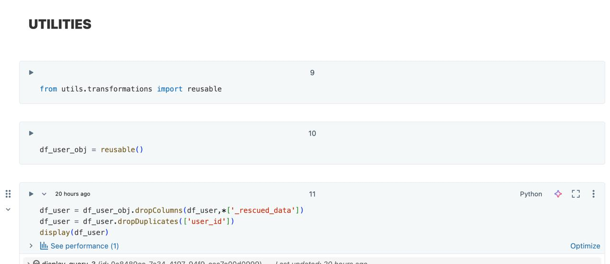
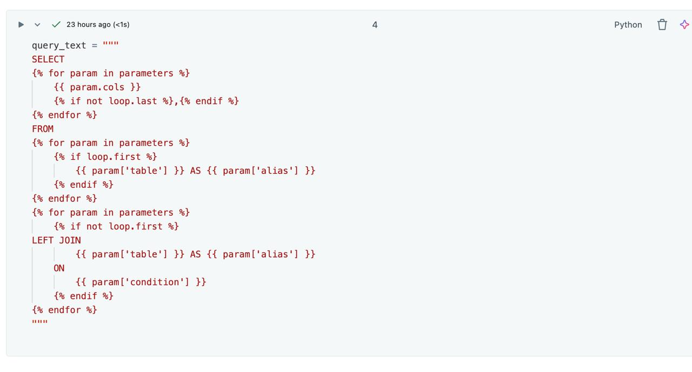
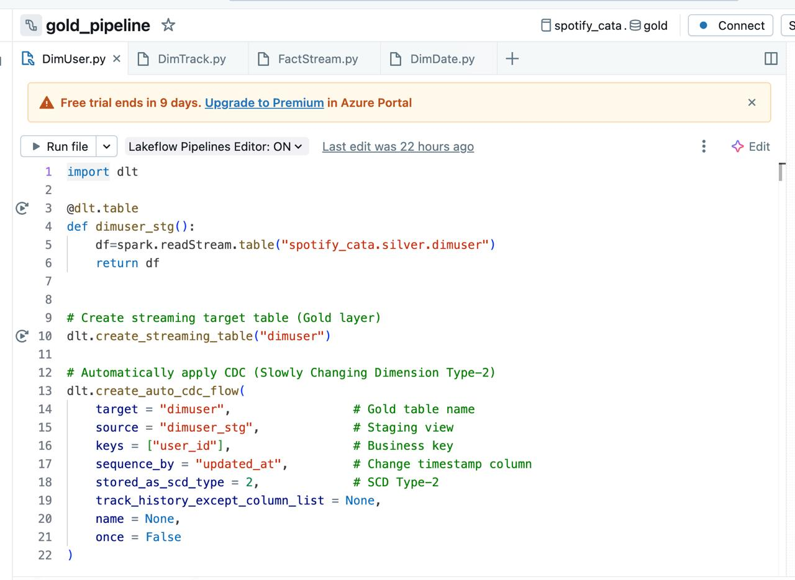
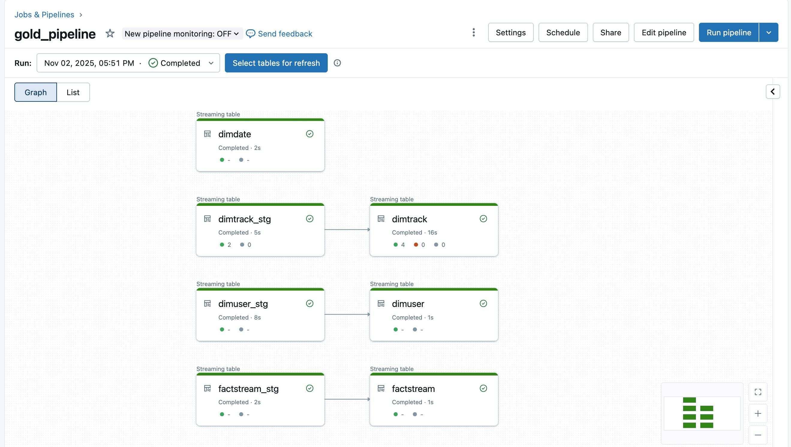
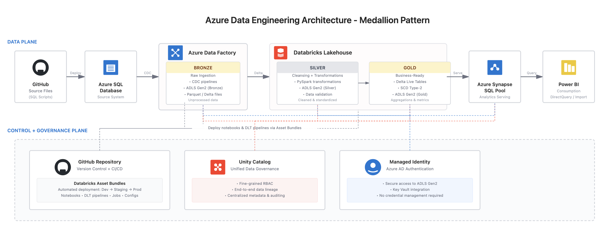

# Production-Grade Medallion Pipeline on Azure & Databricks (CDC, Auto Loader, DLT, CI/CD)

End-to-end data engineering pipeline inspired by Spotify data flows, built on **Azure + Databricks** using the **Medallion Architecture**.

Key highlights:
- Incremental ingestion using **Azure Data Factory (CDC)**
- Raw zone stored in **ADLS Bronze**
- **Databricks Auto Loader** starts from Bronze → Silver (not at ingestion)
- **DLT + SCD-2** for Gold business tables
- **Databricks SQL Warehouse** + Power BI serving
- CI/CD using **Databricks Asset Bundles** + GitHub
- **Unity Catalog + Managed Identity** for governance & secure access

---

## 🏗️ Architecture Diagram


```text
project-root/
├─ Architecture/
│  └─ azure_medallion_architecture.png
├─ azure-data-factory/
│  ├─ pipelines/
│  │  └─ cdc_pipeline.json
│  ├─ datasets/
│  └─ linked-services/
├─ databricks/
│  ├─ asset-bundle/
│  └─ src/
│     ├─ silver/
│     ├─ gold/
│     │  └─ dlt/
│     └─ jinja/
├─ utils/
└─ README.md
```
## ☁️ Azure Resource Group & Provisioned Services

All cloud resources for this project are deployed inside a dedicated Azure Resource Group.

### Resource Group: `RG-AzureSpotify`

| Service | Purpose |
|---|---|
Azure SQL Database | Source transactional database  
Azure SQL Server | SQL hosting for source DB  
Azure Data Factory (V2) | CDC pipeline → Bronze  
Azure Databricks Workspace | Medallion ETL + DLT  
Azure Storage Account (ADLS Gen2) | Bronze / Silver / Gold zones  
Access Connector for Databricks | Secure access to ADLS  
Logic App | Alerts & automation  
Office365 Connection | ADF + Logic App notifications  

### Resource Group Screenshot


---

## 🔄 Source → Azure SQL → Bronze (Azure Data Factory - CDC)

### 📌 End-to-End Flow
GitHub scripts → Azure SQL (Source DB) → ADF CDC → ADLS **Bronze**

### 📸 Pipeline UI  


### Responsibilities
- Run SQL scripts from GitHub to load source tables
- Detect incremental changes via **SQL CDC**
- Land raw parquet data into **ADLS Bronze**
- Maintain **watermark + last CDC time**
- Trigger downstream pipelines (Silver)

### Output (Bronze Zone)
- Raw data (no transformations)
- Immutable append-only storage
- Audit, replay, recovery possible


## Transition — Bronze → Silver

- Data moves from **Bronze to Silver**
- Triggered via **Databricks Auto Loader**
- Applied in next section

## 🧠 Databricks Medallion — Silver & Gold

### Silver Layer (Auto Loader + PySpark)

#### Purpose
Clean + standardize streaming data from Bronze

#### Actions
- Auto Loader reads raw parquet
- Schema enforcement + dedupe
- Data type casting & null handling
- Save to **Delta tables in Silver**

### 📸 Auto Loader UI 


### 🧰 Reusable Utilities for Transformation Logic

During Silver layer processing, reusable utility functions were leveraged to enforce clean, modular transformations across notebooks. These utilities were imported into Databricks notebooks to standardize cleansing, deduplication, and metadata handling during Silver ETL.

#### Utility Import


#### Utility Usage


---

### Gold Layer (DLT + Jinja + SCD-2)

#### Purpose
Business-ready tables with CDC intelligence

#### Key Capabilities
- Delta Live Tables (Streaming)
- SCD-2 on dimensions
- Fact incremental merge
- Jinja SQL automation
- Validations + lineage

### 📸 Jinja Template  


### 📸 Gold Star Schema  


### 📸 Gold DLT Pipeline  



---

## 🚀 CI/CD — Databricks Asset Bundles



This project uses **Databricks Asset Bundles** to validate and plan deployments for Dev & Prod environments.


---


